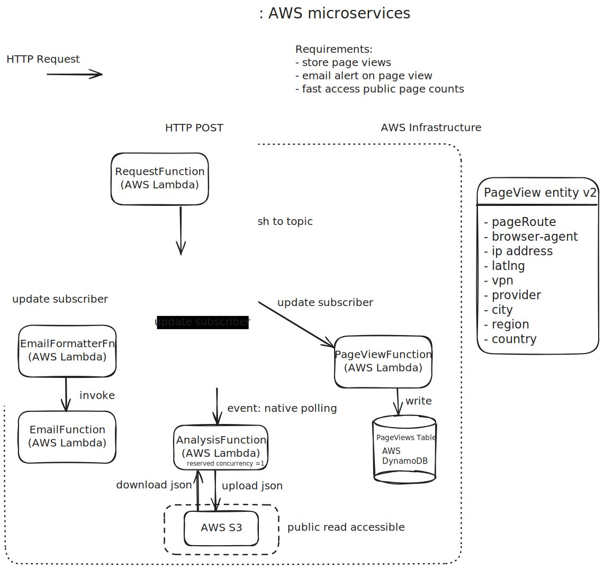

# Lambda Functions

## Request Function
Fetches information about the request
### Input
```
{
    pageRoute: string;
    browserAgent: string;
    ipAddress: string;
    dateTime: string;
}
```
### Output
```
{
    pageRoute: string;
    browserAgent: string;
    ipAddress: string;
    dateTime: string;
    latLng: string;
    provider: string;
    vpn: boolean;
    city: string;
    region: string;
    country: string;
}
```

## PageView Function
Records page views in DynamoDB for historical stats
### Input
```
{
    pageRoute: string;
    browserAgent: string;
    ipAddress: string;
    dateTime: string;
    latLng: string;
    provider: string;
    vpn: boolean;
    city: string;
    region: string;
    country: string;
}
```
### Output
- None


## Email Formatter
Takes page views and put them into an email template
### Input
```
{
    pageRoute: string;
    browserAgent: string;
    ipAddress: string;
    dateTime: string;
    latLng: string;
    provider: string;
    vpn: boolean;
    city: string;
    region: string;
    country: string;
}
```
### Output
- None